# MyGram (Hacktiv8 Golang Final Project)

## Deskripsi Project
Project ini berfokus dalam pembuatan aplikasi untuk MyGram, dimana dalam aplikasi ini dapat bekerja seperti sosial media, yaitu menyimpan foto, membuat comment untuk foto orang lain. 

Link API Docs: [https://h8-mygram-production.up.railway.app/docs/index.html](https://h8-mygram-production.up.railway.app/docs/index.html)

Berikut library yang digunakan adalah:
- Gin gonic untuk web service
- Gorm untuk ORM
- JsonWebToken (JWT) untuk auth
- Ozzo Validation untuk validasi input

Berikut endpoint yang dibuat:
- Register User
- Login User
- Get All (Photo, Comment dan Social Media)
- Create (Photo, Comment dan Social Media)
- Create (Photo, Comment dan Social Media)
- Update (Photo, Comment dan Social Media)
- Delete (Photo, Comment dan Social Media)

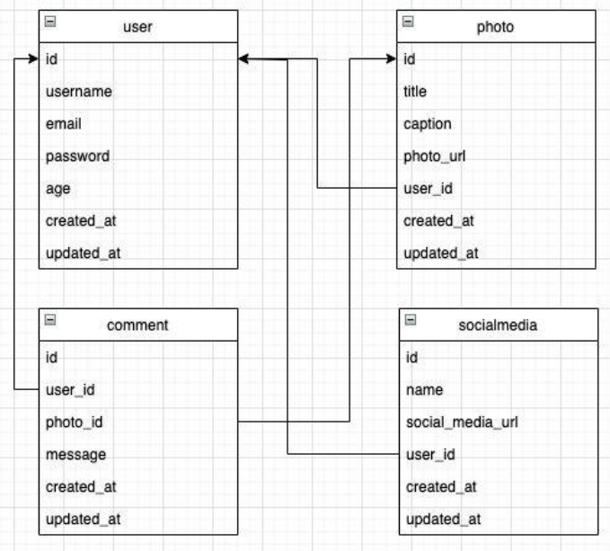

## Output
### Register User
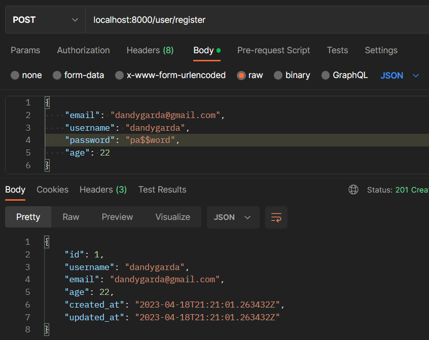

### Login User
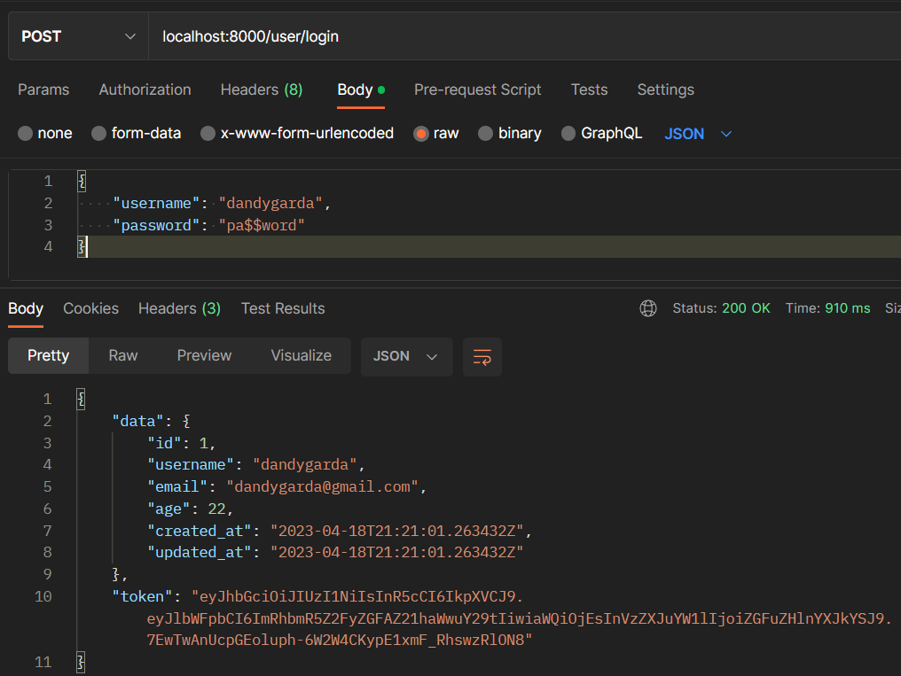

---
### Create Social Media
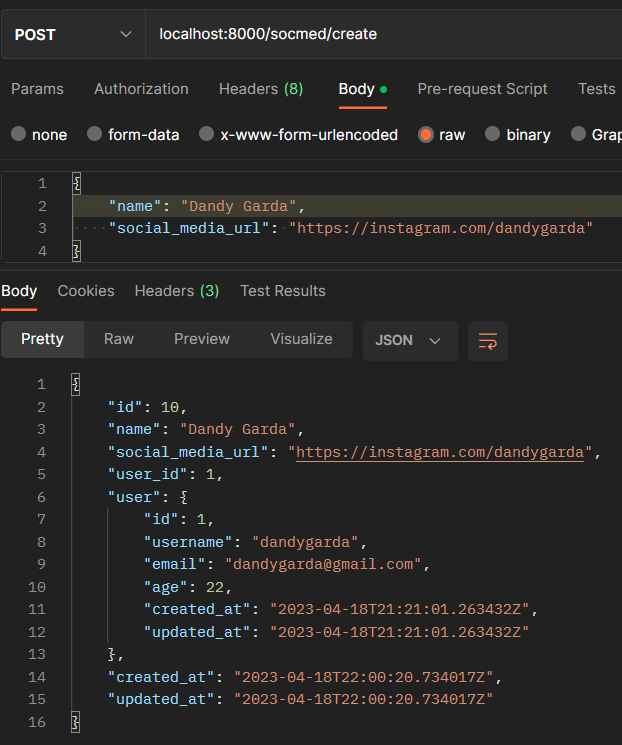

### Get All Social Media
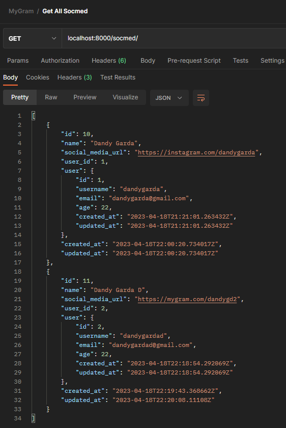

### Get Social Media by ID
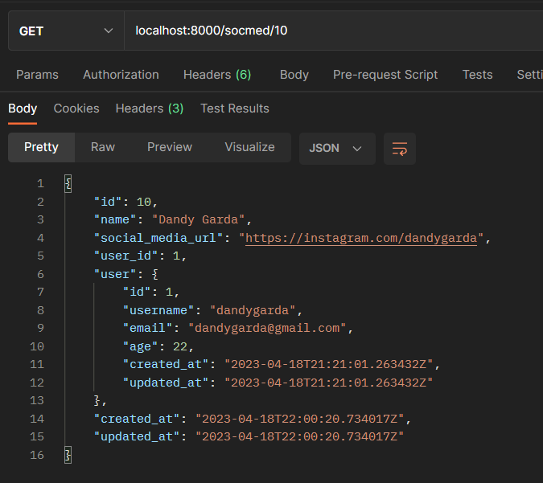

### Update Social Media
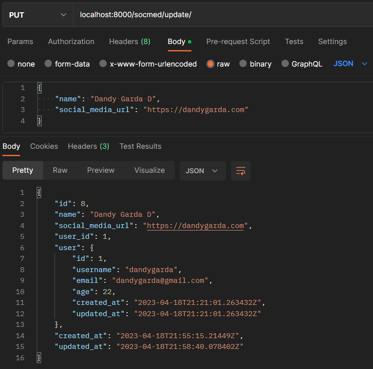

### Delete Social Media
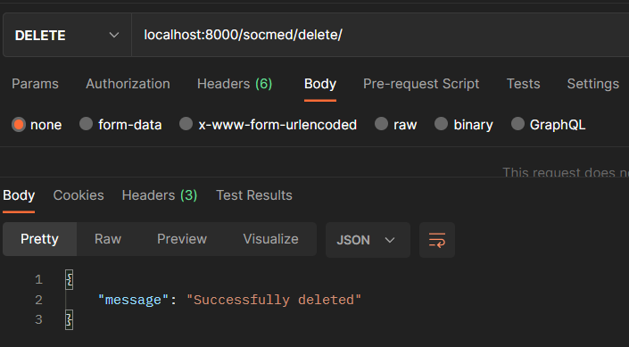

---
### Create Photo
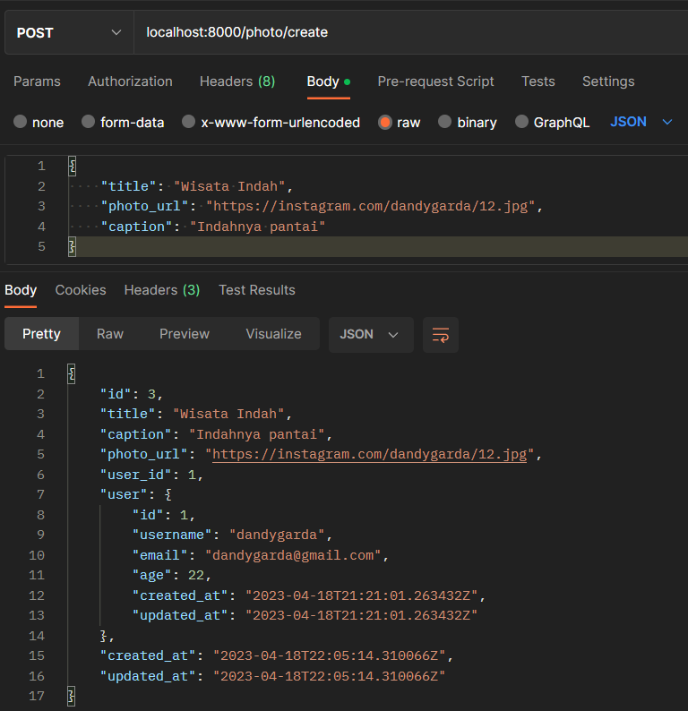

### Get All Photo
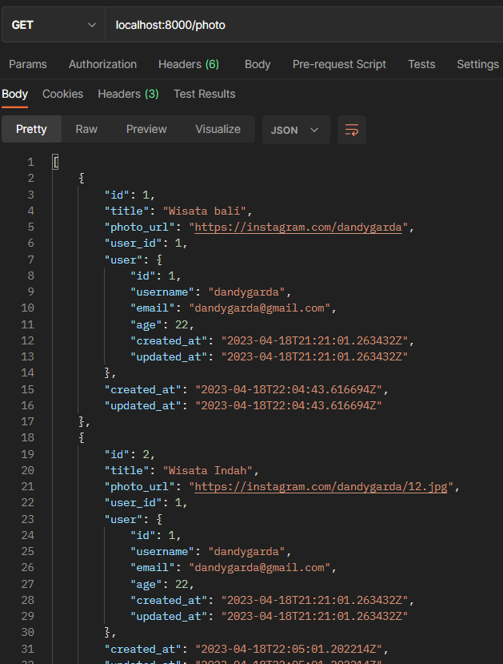

### Get Photo by ID
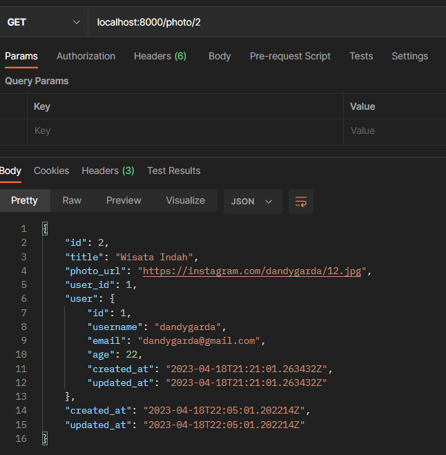

### Update Photo
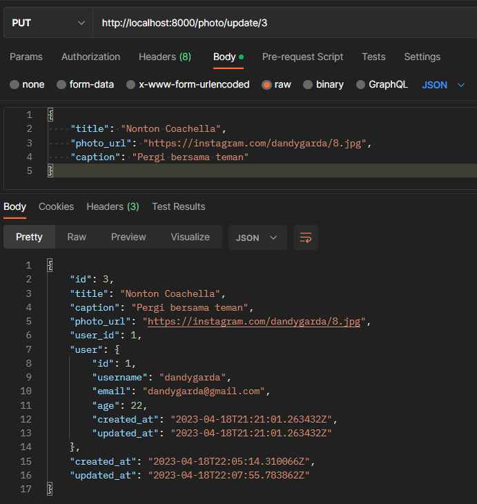

### Delete Photo
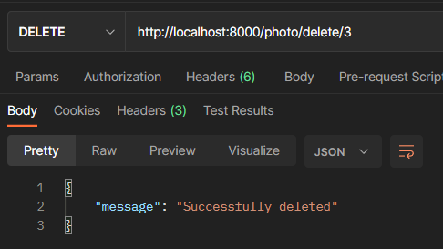

---
### Create Comment
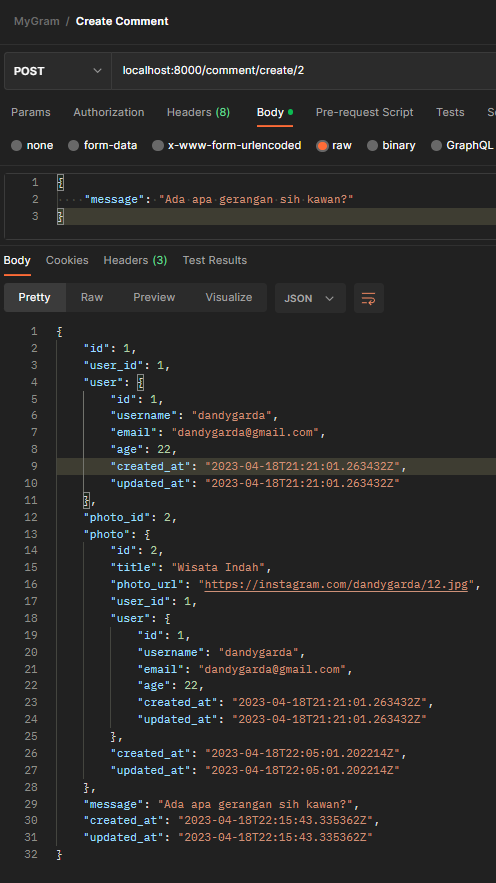

### Get All Comment
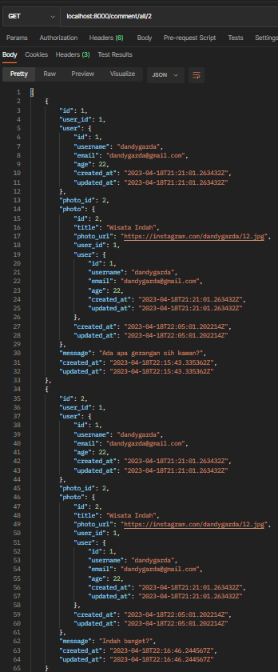

### Get Comment by ID
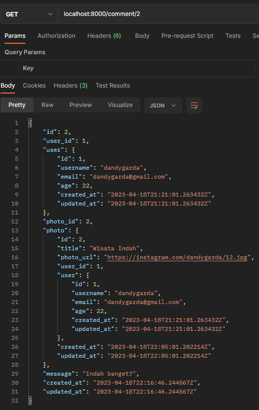

### Update Comment
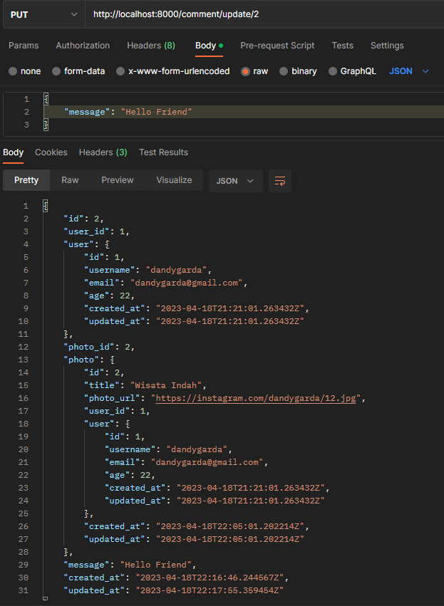

### Delete Comment
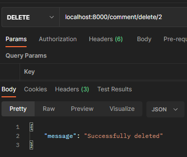